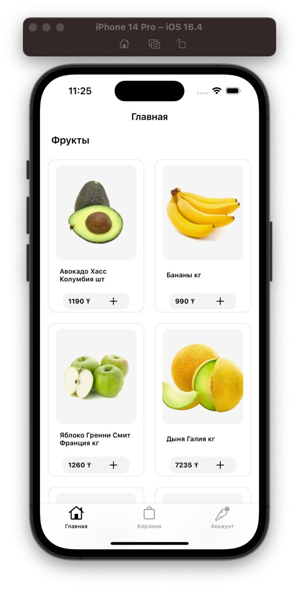
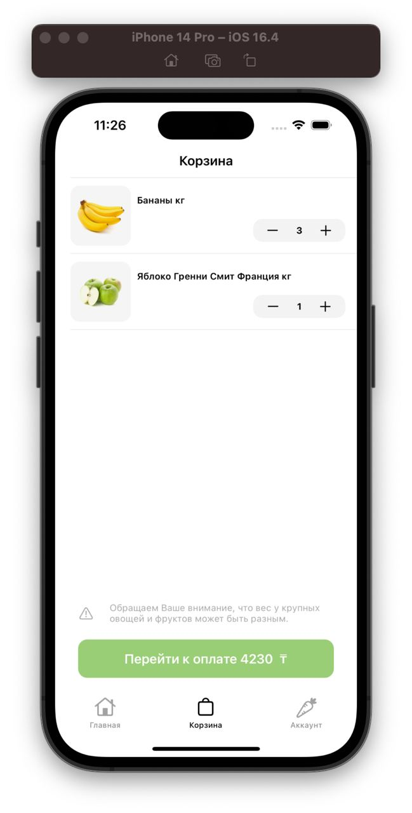
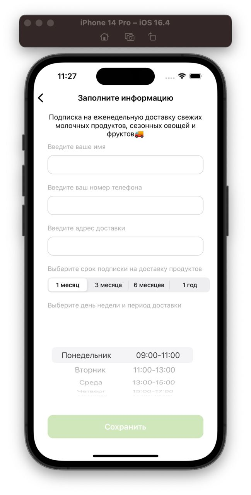
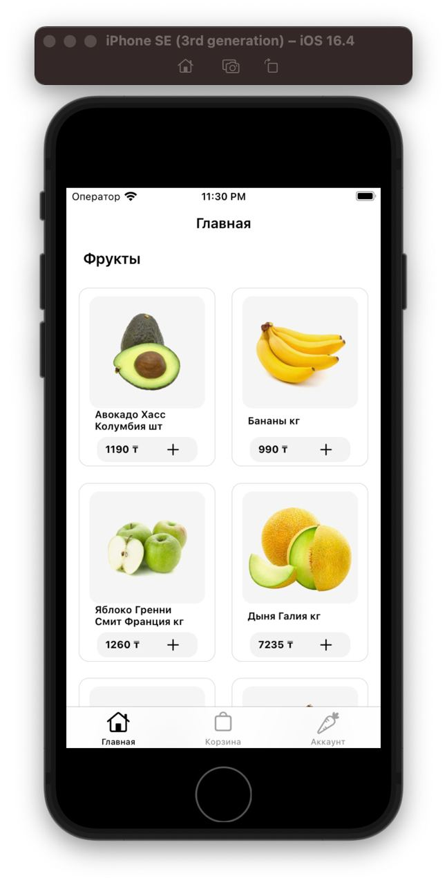
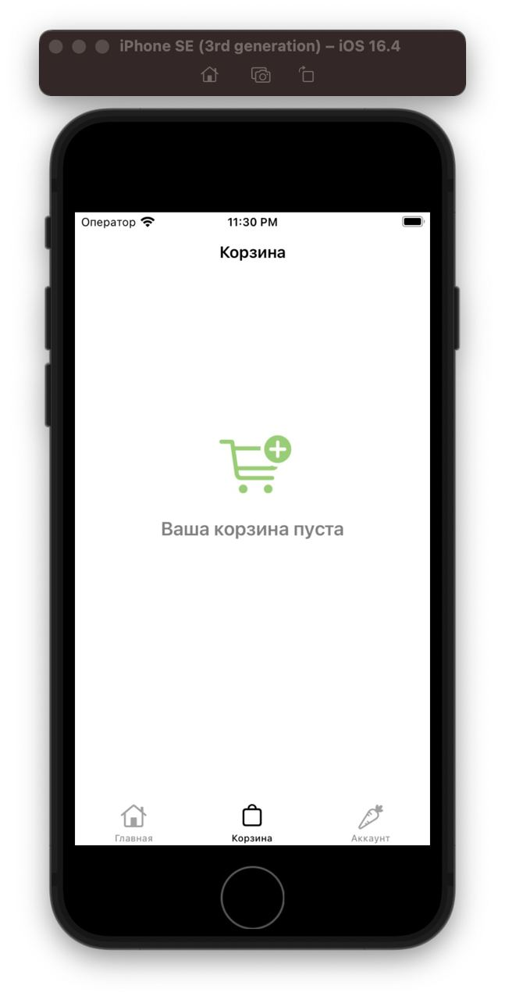
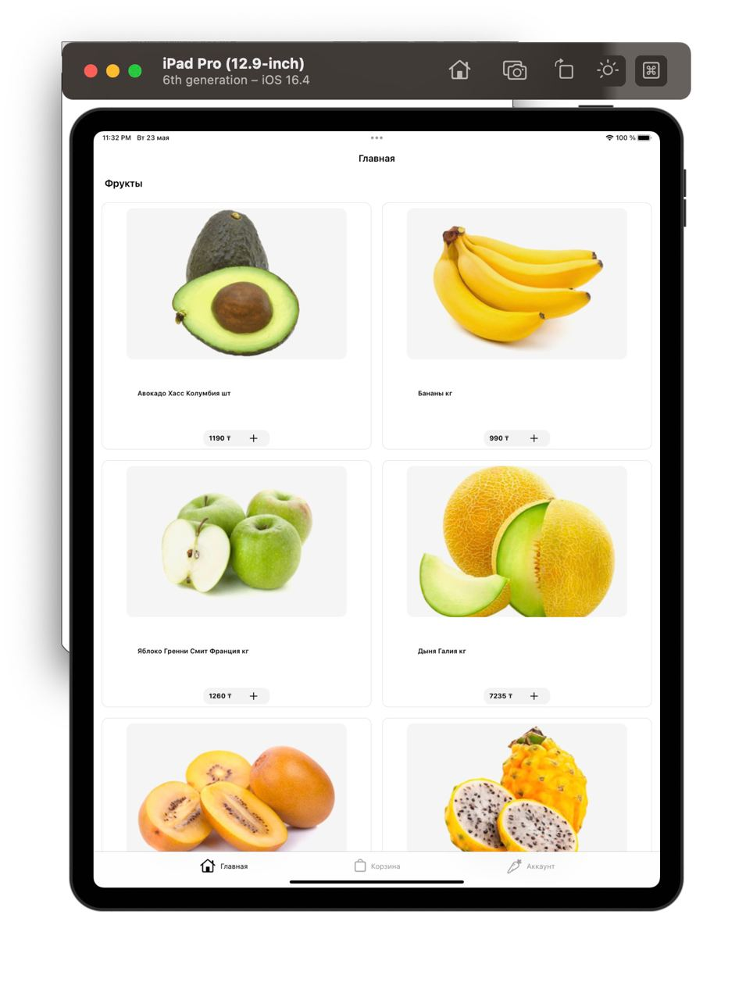
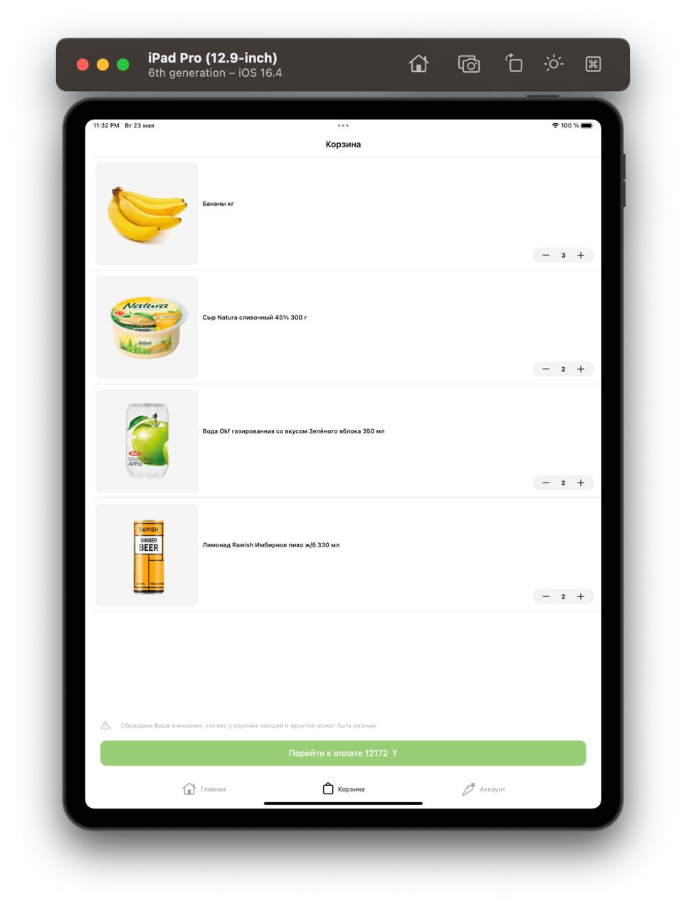

# FoodieHub
<h1>Техническое задание для стажировки в Arbuz.kz: Еженедельная доставка свежих молочных продуктов, овощей и фруктов</h1>

<h2>Выполнила Тажиева Акмарал, 2023</h2>

Приветствую! Добро пожаловать в репозиторий проекта "Arbuz.kz: Еженедельная доставка свежих молочных продуктов, овощей и фруктов.

<h2>Описание проекта</h2>

В рамках этого проекта компания Arbuz.kz запускает новую услугу подписки на еженедельную доставку свежих молочных продуктов, сезонных овощей и фруктов. Наша цель - обеспечить клиентов свежими и качественными продуктами, доставляемыми прямо в дом каждую неделю.

<h2>Функциональности продукта</h2>

<ul>
  <li>✔️Составление корзины из комбинации нескольких продуктов (например: сметана, малина, кукуруза).</li>
  <li>✔️Выбор дня недели и периода доставки.</li>
  <li>✔️Учет веса крупных овощей и фруктов.</li>
  <li>✔️Указание адреса доставки и контактного телефона заказчика.</li>
  <li>✔️Выбор срока подписки на доставку этих продуктов.</li>
  <li>✔️Учет наличия выбранных продуктов.</li>
</ul>

<h2>Скриншоты приложения для разных устройств</h2>

Список использованных технологий

<ul>
  <li>✔️Snapkit - для верстки экран</li>
  <li>✔️Кастомные кнопки</li>
  <li>✔️Кастомные UI-textfields</li>
  <li>✔️Валидация Input-ов</li>
  <li>✔️Сохранение данных пользователя в User Defaults</li>
  <li>✔️Адаптивная верстка</li>
</ul>
